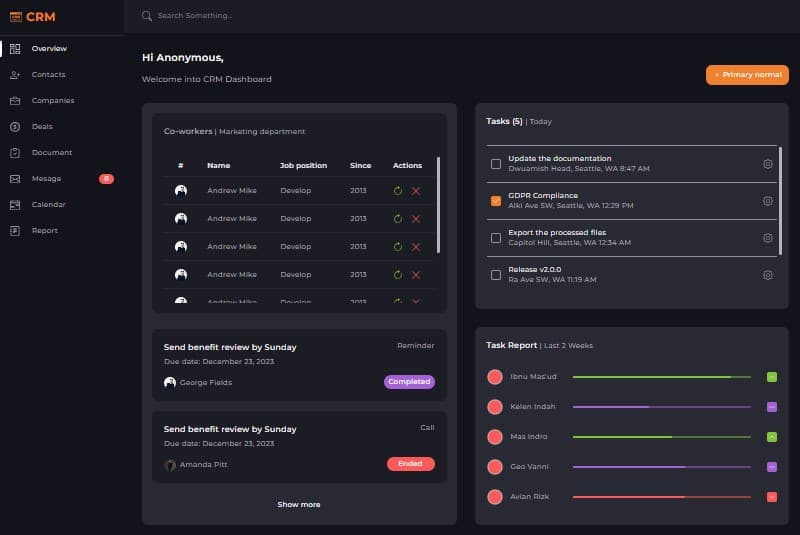

## 𝕊ℂ𝕊𝕊-ℂℝ𝕄

  

CRM website simulation (without logic) with SCSS-based styling.

## 𝔽𝕖𝕒𝕥𝕦𝕣𝕖𝕤 𝕒𝕟𝕕 𝕋𝕖𝕔𝕙𝕟𝕠𝕝𝕠𝕘𝕚𝕖𝕤 ᎓    

</a>&nbsp;
  &nbsp;
  &nbsp;
  &nbsp;
  &nbsp;
  &nbsp;
  &nbsp;  
  
※ Using the modular system in pattern 7-1.  
※ Working with variables, math operations, interpolation, mixins, placeholders.  
※ Organizing blocks of code to reuse styles.  

## 𝕀𝕟𝕤𝕥𝕒𝕝𝕝𝕒𝕥𝕚𝕠𝕟 ᎓  

To get started with this project, follow the installation instructions below.

1. Clone the repository:
   ```bash
   git clone https://github.com/Morifer79/scss-project_crm.git
   cd scss-project_crm-app
   ```
2. Install the dependencies:
   ```bash
   npm install
   ```
3. Start the development server:
   ```bash
   npm start
   ```
4. Open to view it in the browser:  
<a href="https://morifer79.github.io/scss-project_crm/"></a>

## 𝔼𝕞𝕒𝕚𝕝 𝕞𝕖 ᎓
Questions, suggestions, help:  
<a href="mailto:cyber-morifer@proton.me"></a>
   
